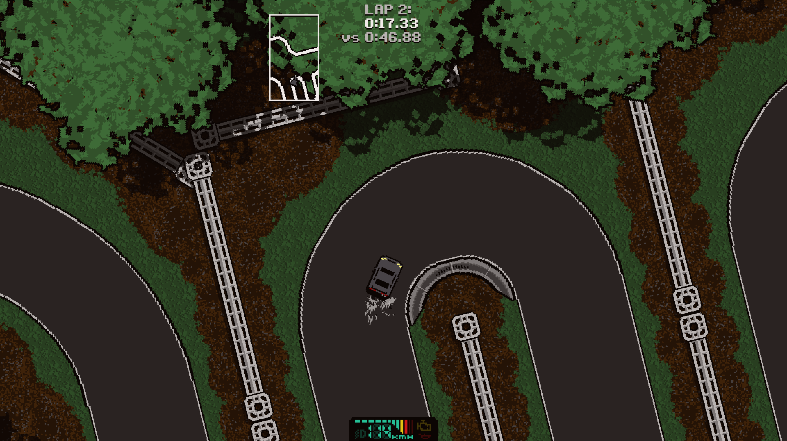
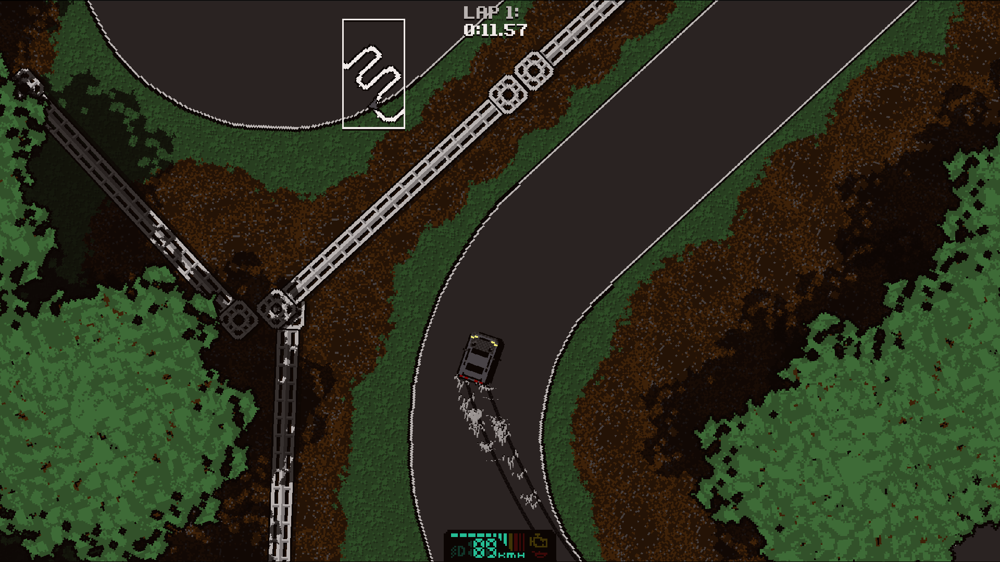
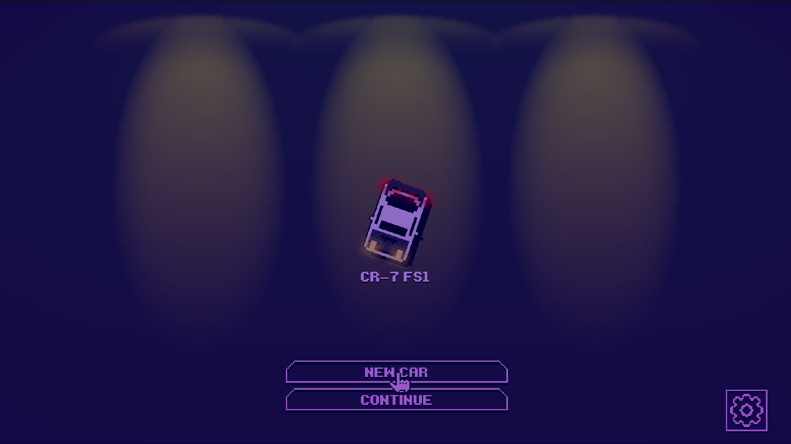
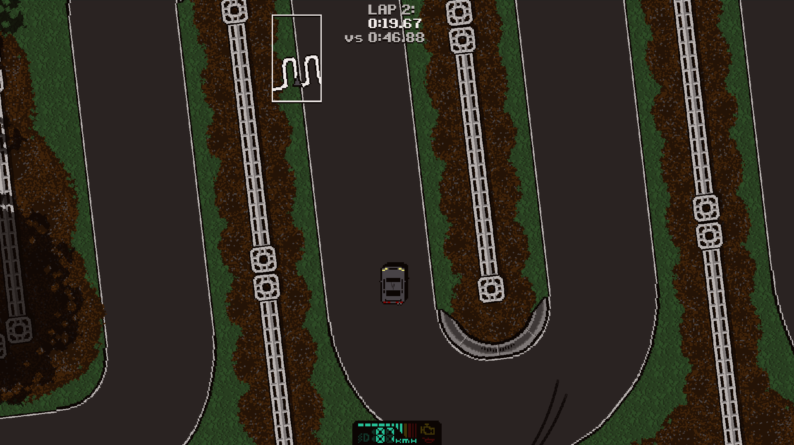
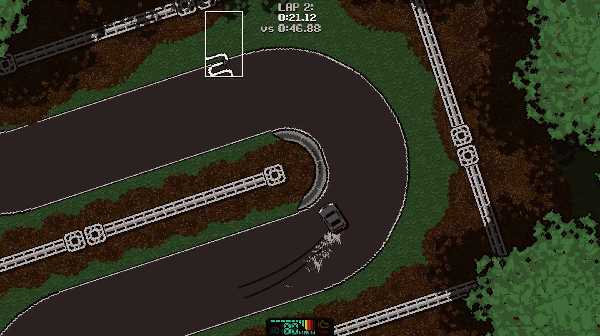
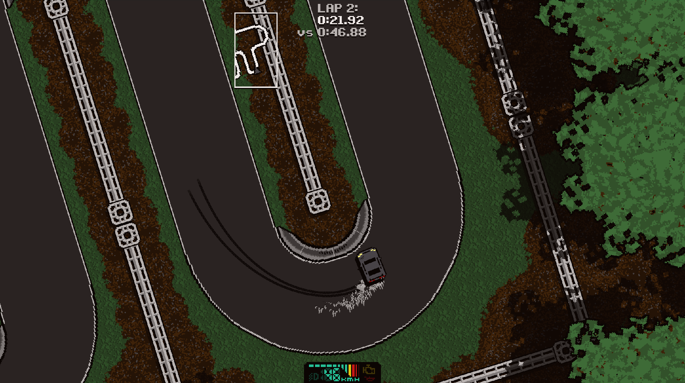

# The Demon of Sakura Pass

<p align="center"></p>

JAPAN, 1995:

Sakura Pass. Your brother came here every night, until one morning, he didn't come back. He's not the only driver who has been claimed by these dangerous roads.

What was so important to him here?

Can you finish what he started?

This is a brutal single-player racing game with simplified, friendly driving mechanics that reward a good racing line and savagely punish bad technique. Focus on learning each track's unique challenges to overcome each racer and move on to the next. Unwrap the mystery haunting Sakura Pass in a stage-by-stage campaign. As one stage race is won, the next unlocks.

Each car is carefully balanced to provide a unique driving experience; some may be slower, faster, more slippery, more grippery, heavier or lighter, but each one is capable of banishing the evil lurking on these mountain roads if your technique is good enough. Make your machine yours by choosing a model that fits your driving style and customizing with various cosmetic upgrades. 

## Current Campaign Stages

- Stage-1
- Stage-2
- Stage-3
- Stage-4
- Stage-5
- Stage-6
- Stage-Boss

## Changelog

### v0.75

- Initial Release.

## Setup Instructions (For End Users)

- Download and install to the main directory (usually `ux0:`) and choose install, once installed you can delete the SakuraPass.vpk file to prevent clutter:

```
ux0:SakuraPass.vpk
```
No additional Data Files are required.

<p align="center"></p>
<p align="center"></p>
<p align="center"></p>
<p align="center"></p>
<p align="center"></p>
<p align="center"></p>
<p align="center"></p>
